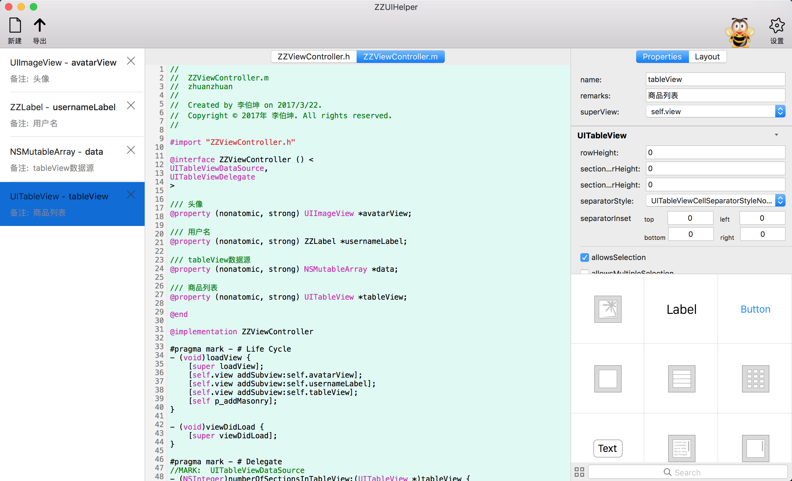

 

# ZZUIHelper

ZZUIHelper是为手写UI党（iOS）提供的辅助工具（Mac App），通过类似xib/sb的选择和编辑操作，可以自动生成对应的Objective-C代码，能够大大减少简单重复工作量。

### 演示视频：

<iframe width=640 height=498 src="https://v.qq.com/iframe/player.html?vid=e0384ltek23&tiny=0&auto=0">

## 更新记录
### 1.1.0
* 1、加入ZZFLEX代码生成器，ZZUIHelper是一款完善的iOS敏捷开发框架，设计原则为“UI控件的模块化”，可大大提升开发和维护效率，开源地址:<https://github.com/tbl00c/ZZFLEX>。
* 2、优化部分逻辑代码。

## 主要功能

ZZUIHelper的主要功能是，根据我们配置去生成代码，目前可生成的代码模块包括：

* 声明周期函数（addSubView等）
* 代理方法（tableView等）
* 事件响应方法（UIButton等）
* 添加约束的布局方法（Masonry）
* Getter方法（控件的生成方法，可配置各种属性）

目前提供了两种风格的代码生成器：

* LazyLoad Creator

* Setup UI Creator

可在“设置”-“Creator”中切换，并调整模块数据

## 使用方法

### 1. 新建文件
目前支持生成以下类为最外层容器类的代码

* UIViewController
* UIView
* UITableViewCell
* UICollectionViewCell
* UIImageView
* UIScrollView   

### 2. 添加控件
从控件区点击需要的控件添加，支持自定义父类名

### 3. 编辑控件属性
选中元素区的控件后，可以根据需要在属性编辑区对某些属性进行编辑

### 4. 选择控件事件响应函数或代理方法
选中元素区的控件后，可以根据需要在属性编辑区选择需要的事件响应函数（支持修改方法名）和代理方法

### 5. 添加约束条件
注：设置必要的参数后，会自动勾选

### 6. 导出类文件
点ToolBar上的导出按钮，选择位置后可导出类文件

### 7. 其他
在设置中，支持修改类头部的版权信息，支持添加自定义的颜色和字体，支持个性化代码区风格设置。

## 其他
使用中的问题或者建议请联系：libokun@126.com